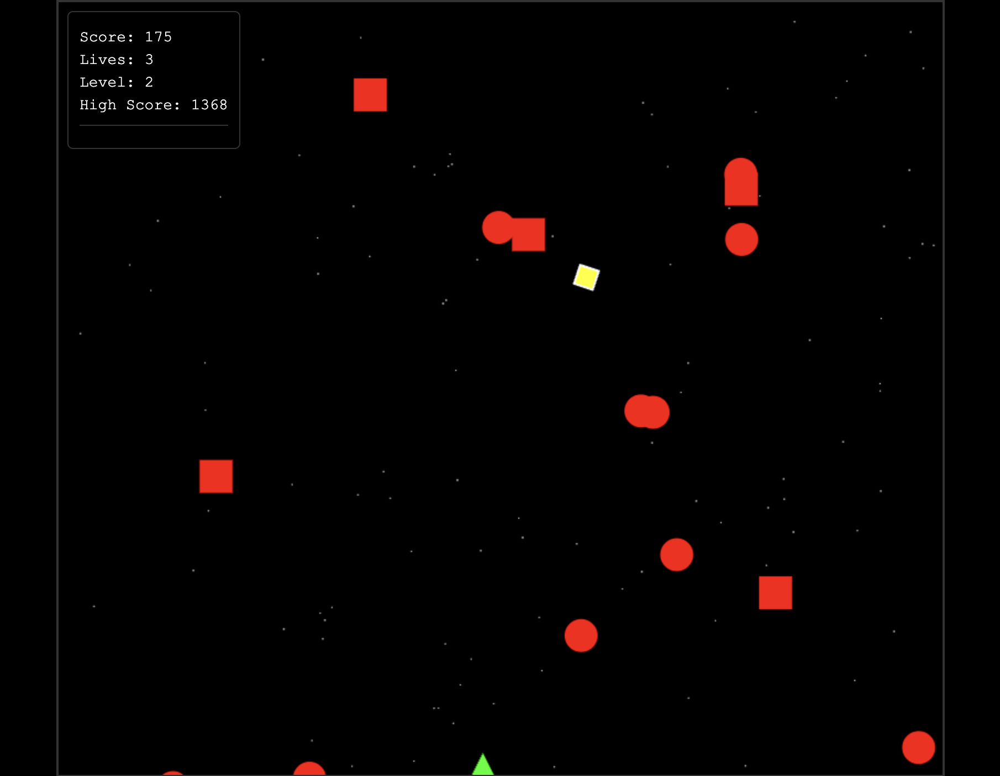
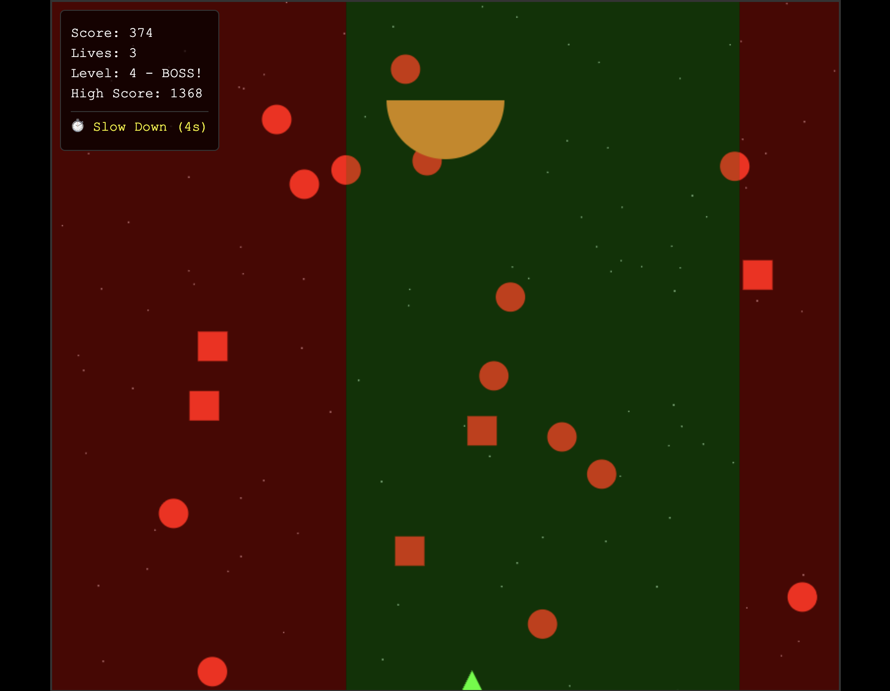

# Space Dodger

An arcade-style dodging game with progressive difficulty

**Demo:** https://space-dodger.surge.sh/

## Instructions

### How to Play
- **Mouse Move** – Your ship follows the mouse horizontally.
- **Avoid Obstacles** – Dodge falling objects, boss attacks, and special hazards.
- **Collect Power-Ups** – Shield (absorbs 1 hit in 10 seconds) and Slow-Down (reduces falling speed by 20% in 10 seconds).
- **Boss Levels** – Every 4 levels a boss attack pattern starts.
- **Score** – Earn points over time, and the game speeds up over time.

## Screenshots




### Local Setup
```bash
git clone <repo>
cd space-dodger

# Run frontend (either server works)
python3 -m http.server 8000
npx http-server -p 8000
http://localhost:8000
```

### Backend
The deployed frontend uses the backend at `https://space-dodger-api.onrender.com`. When the
frontend is served from `localhost`/`127.0.0.1`, `config.js` automatically targets
`http://localhost:3000` instead, so playtest scores never reach the production leaderboard.
If no local backend is running, the game still works — leaderboard features just show as
unavailable.

To run the backend locally:
```bash
cd backend
npm install
cp env.example .env  # add MONGODB_URI
npm start
```

## Tech Stack

| Section   | Technologies |
|-----------|--------------|
| Frontend  | JS, HTML5 Canvas, CSS |
| Backend   | Node.js, Express, MongoDB, REST API |
| Hosting   | Surge (frontend), Render (backend) |
| Storage   | LocalStorage |

## Deployment Notes
- `render.yaml` defines the backend for Render.
- Set `MONGODB_URI` as a Render environment variable and not committed.
